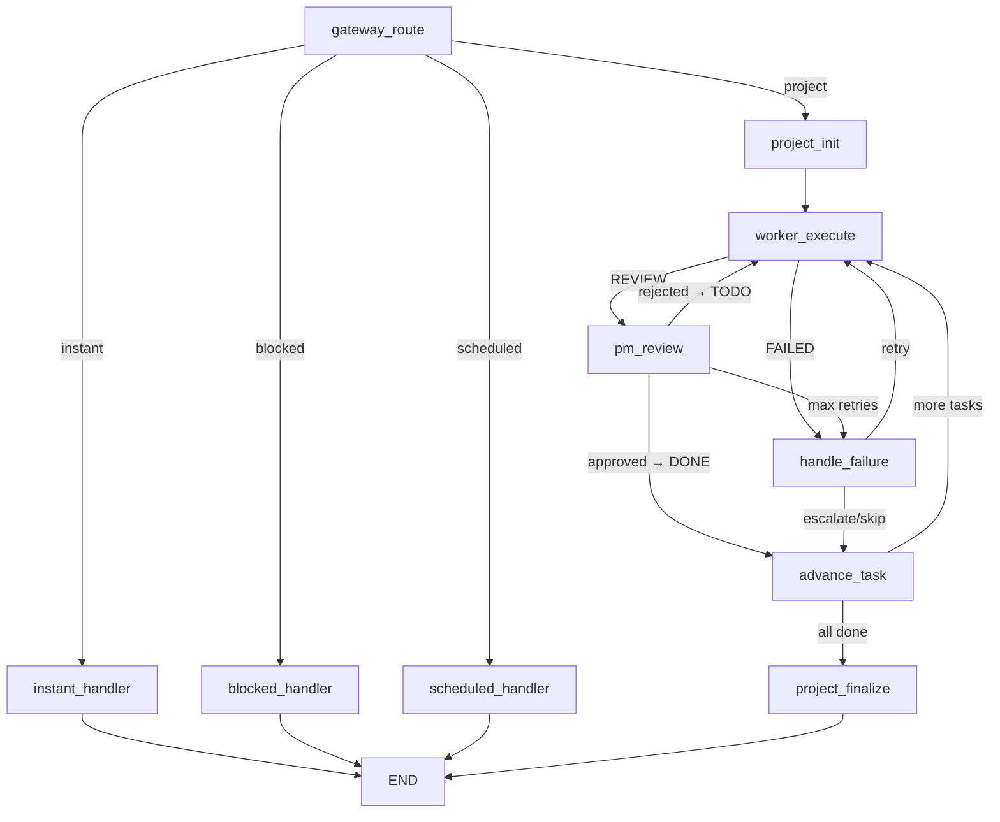

# 多Agent工作流编排系统 — 学习文档

> 本文档面向团队成员，帮助从零开始理解整个系统的架构设计、核心模块、数据流转和关键技术决策。

---

## 1. 项目概述

### 1.1 系统定位

本系统是一个**企业级多Agent工作流编排平台**，本质是**任务编排系统**，而非"多个模型互相聊天"。

核心目标：让多个专业 AI Agent 协同完成复杂任务，同时保证**可控、可恢复、可追踪、可隔离**。

### 1.2 解决的核心问题

| 问题 | 解决方案 |
|------|----------|
| 复杂任务无法由单个 Agent 完成 | PM Agent 拆解为多个子任务，Worker 分工协作 |
| Agent 间自由协作导致混乱 | Gateway + PM + Worker **显式编排**，职责边界清晰 |
| 任务失败无法恢复 | 显式状态机 + 重试机制 + 人工介入接口 |
| 运行过程不可观测 | 每次 Agent 调用记录完整 Trace（token、延迟、状态） |
| 多租户数据越权风险 | 四层隔离：运行态 / 数据态 / 工具态 / Prompt 注入防护 |

### 1.3 三类任务入口

```
用户请求 ──→ Gateway（意图分类）
              ├── instant（即时任务）──→ 单个 Worker 直接执行
              ├── project（项目型任务）──→ PM 拆解 → Worker 依次执行 → PM 验收
              ├── scheduled（定时任务）──→ 解析自然语言 → 注册调度任务 → 后台定时触发
              └── blocked（注入检测命中）──→ 拒绝请求
```

- **即时任务**：问答、单次分析、单角色执行，追求低延迟和低成本
- **项目型任务**：需求分析、开发、测试等长链路任务，多 Agent 协作
- **定时任务**：周报、巡检、定时分析等，解析为 cron 表达式后注册到调度器，后台轮询触发

---

## 2. 技术栈说明

| 技术 | 版本/类型 | 选型理由 |
|------|-----------|----------|
| **Python 3.11+** | 语言 | 生态成熟，AI/LLM 库丰富 |
| **LangGraph** | 工作流编排 | 支持显式状态图、条件边、节点编排，适合白盒调试和状态恢复 |
| **LangChain** | LLM 调用抽象 | 统一的 ChatModel 接口、消息封装、Token 统计 |
| **FastAPI** | HTTP 框架 | 原生 async、自动 OpenAPI 文档、Pydantic 集成 |
| **PostgreSQL** | 持久化存储 | JSONB 支持（验收标准、产物存储）、GIN 索引、部分索引、TIMESTAMPTZ |
| **asyncpg** | DB 驱动 | 纯异步 PostgreSQL 驱动，连接池性能优异 |
| **Pydantic v2** | 数据模型 | 类型安全的数据验证，与 FastAPI 深度集成 |
| **pydantic-settings** | 配置管理 | 从环境变量/.env 文件自动加载配置 |
| **uvicorn** | ASGI 服务器 | 高性能异步 HTTP 服务器，支持热重载 |
| **Langfuse** | 可视化追踪 | 开源自部署，Agent 调用链追踪，支持 trace/span 可视化 |
| **APScheduler** | 定时调度 | 计算 cron 下次执行时间，配合 asyncio 轮询实现调度 |
| **ruff** | 代码检查 | 极速 Python linter，替代 flake8 + isort |

### 模型分层策略

| 层级 | 模型 | 选型原则 |
|------|------|----------|
| Gateway 路由层 | `gpt-4o-mini` | 追求稳定输出结构化 JSON，小模型降低延迟和成本 |
| PM Agent 编排层 | `gpt-4o` | 优先任务拆解能力和指令遵循 |
| Worker 执行层 | `gpt-4o` | 优先专业能力（代码、分析、测试），质量优先 |

---

## 3. 系统架构设计

### 3.1 整体分层架构

```
┌─────────────────────────────────────────────────────────┐
│                    Frontend (SPA)                        │
│   index.html (C端)          admin.html (管理端)          │
└────────────────────┬────────────────────────────────────┘
                     │ HTTP /api/v1/*
┌────────────────────┴────────────────────────────────────┐
│                  FastAPI Application                      │
│  routes.py (API)  │  main.py (生命周期/静态页面)          │
└────────────────────┬────────────────────────────────────┘
                     │
┌────────────────────┴────────────────────────────────────┐
│              LangGraph Workflow (workflow.py)             │
│                                                          │
│  ┌──────────┐    ┌──────────────┐    ┌───────────────┐  │
│  │ Gateway  │───→│  PM Agent    │───→│ Worker Agents │  │
│  │ Router   │    │  拆解/验收/失败│    │ A/C/T 执行    │  │
│  └──────────┘    └──────────────┘    └───────────────┘  │
│        │                │                    │           │
│        └────────────────┴────────────────────┘           │
│                         │                                │
│                  ┌──────┴──────┐                         │
│                  │  PgStore    │                         │
│                  │ PostgreSQL  │                         │
│                  └─────────────┘                         │
└──────────────────────────────────────────────────────────┘
```

### 3.2 各层职责

| 层级 | 职责 | 不负责 |
|------|------|--------|
| **Gateway** | 意图识别、Prompt 注入检测、路由决策 | 任务拆解、状态维护 |
| **PM Agent** | 项目拆解、验收审查、失败回路处理 | 自己执行具体工作 |
| **Worker** | 完成单一领域任务、输出结构化结果 | 修改全局流程 |
| **PgStore** | 持久化项目/任务/Trace/Prompt | 参与推理决策 |
| **Workflow** | 编排节点流转、条件路由 | 理解业务语义 |

### 3.3 LangGraph 状态机工作流

工作流定义拆分在 `graph/` 目录下的多个文件中，使用 LangGraph 的 `StateGraph` 构建。

#### 文件拆分结构

| 文件 | 职责 |
|------|------|
| `graph/state.py` | `WorkflowState` TypedDict 状态定义 |
| `graph/nodes.py` | 所有工作流节点函数（gateway_route、worker_execute、pm_review 等） |
| `graph/conditions.py` | 条件路由函数（route_after_gateway、route_after_review 等） |
| `graph/workflow.py` | 图构建（`build_workflow`）与运行入口（`run_workflow`），精简后的编排入口 |

#### 节点（Nodes）

```
gateway_route      → Gateway 意图分类
instant_handler     → 即时任务处理（单 Worker 执行）
blocked_handler     → 注入拦截处理
scheduled_handler   → 定时任务处理（解析自然语言 → 注册调度任务）
project_init        → 创建项目 + PM 拆解任务
worker_execute      → Worker 执行当前任务（Trace 持久化到 DB + Langfuse）
pm_review           → PM 验收 Worker 输出（Trace 持久化到 DB + Langfuse）
handle_failure      → PM 处理任务失败（状态前置检查 + Trace + Langfuse + 人工介入通知）
project_finalize    → 汇总项目结果（含 HUMAN_PENDING 时项目状态为 PAUSED）
advance_task        → 推进到下一个任务
```

#### 条件路由（Conditional Edges）



#### 核心状态（WorkflowState）

```python
class WorkflowState(TypedDict):
    user_input: str           # 用户原始输入
    tenant_id: str            # 租户隔离
    route_decision: dict      # Gateway 路由结果
    project: dict             # 项目信息
    tasks: list[dict]         # 任务列表（PM 拆解结果）
    current_task_index: int   # 当前执行到第几个任务
    worker_output: dict       # Worker 执行输出
    rejection_reason: str     # PM 拒绝原因（重试时传给 Worker）
    final_response: str       # 最终响应
    trace_logs: list          # 累积的 Trace 日志
    error: str                # 错误信息
```

---

## 4. 核心模块详解

### 4.1 Gateway 路由层 — `gateway/router.py`

Gateway 是系统的"门卫"，负责三件事：**注入检测 → 意图分类 → 路由决策**。

#### Prompt 注入检测

使用正则表达式匹配常见注入模式，在 LLM 调用之前拦截：

```python
INJECTION_PATTERNS = [
    r"忘记你的(所有|全部|之前).*(规则|指令|设定)",
    r"忽略(以上|之前|所有).*(规则|指令|设定|限制)",
    r"ignore\s+(all\s+)?(previous|above|prior)\s+(instructions|rules)",
    r"pretend\s+(you\s+are|to\s+be)\s+",
    # ... 共 9 条规则
]
```

#### 路由决策

通过 LLM（`gpt-4o-mini`）对用户请求进行意图分类，输出结构化 JSON：

```json
{"route": "instant|project|blocked", "reason": "分类理由", "suggested_worker": "analyzer|coder|tester|null"}
```

- `instant`：简单任务，直接路由给推荐 Worker
- `project`：复杂项目，交给 PM 拆解
- `blocked`：检测到注入，拒绝请求

### 4.2 PM Agent — `agents/pm_agent.py`

PM 是系统的"项目经理"，有三个核心能力：

| 方法 | 功能 | 输入 | 输出 |
|------|------|------|------|
| `decompose()` | 项目拆解 | 项目描述 + project_id | `list[Task]` + TraceEntry |
| `review()` | 验收审查 | 任务 + Worker 摘要 + 产物 | `ReviewDecision` + TraceEntry |
| `handle_failure()` | 失败处理 | 任务 + 错误信息 | `FailureDecision` + TraceEntry |

**拆解示例**（PM 输出 JSON）：

```json
{
  "project_title": "实现用户认证系统",
  "tasks": [
    {
      "title": "需求分析",
      "description": "分析用户认证系统的需求...",
      "assigned_worker": "analyzer",
      "acceptance_criteria": [
        {"type": "output_exists", "description": "产物已生成"},
        {"type": "output_contains", "key": "JWT", "description": "包含JWT相关内容"}
      ]
    }
  ]
}
```

**验收逻辑**：逐条对照 `acceptance_criteria`，全部满足才通过，否则附上具体不满足条目打回。

**失败处理策略**：
- 前 1-2 次失败 → 优先 `retry`
- 持续相同错误 → `escalate_to_human`
- 不可恢复错误 → `abort`

### 4.3 Worker Agents — `agents/analyzer.py` / `coder.py` / `tester.py`

三个 Worker 继承自 `BaseWorker`，共享统一的执行接口：

```python
class BaseWorker(ABC):
    name: str = ""           # Worker 标识
    prompt_id: str = ""      # DB Prompt 标识（运行时加载）
    system_prompt: str = ""  # 默认 Prompt（fallback）

    async def execute(self, task_id, description, context, rejection_reason):
        # 1. 从 DB 加载 Prompt（有则用 DB，无则用默认）
        # 2. 构建 user message（含上下文 + 拒绝原因）
        # 3. 调用 LLM
        # 4. 解析结构化输出
        # 5. 返回 (WorkerOutput, TraceEntry)
```

| Worker | prompt_id | 职责 | 产物类型 |
|--------|-----------|------|----------|
| `AnalyzerWorker` | `analyzer` | 需求分析、文档研究、方案设计 | `analysis` |
| `CoderWorker` | `coder` | 代码生成、功能实现、脚本开发 | `code` |
| `TesterWorker` | `tester` | 测试计划、代码审查、质量验证 | `test_report` |

**Worker 注册表**（`agents/__init__.py`）：

```python
_WORKER_CLASSES = {
    "analyzer": AnalyzerWorker,
    "coder": CoderWorker,
    "tester": TesterWorker,
}

def get_worker(name: str) -> BaseWorker:
    """Lazy initialization worker registry."""
```

### 4.4 存储层 — `store/pg_store.py`（Facade）+ 领域子 Store

基于 asyncpg 的异步 PostgreSQL 存储层，采用 **Facade 门面模式**，将原单一 `pg_store.py` 拆分为按领域职责划分的子 Store：

#### 文件拆分结构

| 文件 | 职责 |
|------|------|
| `store/pg_store.py` | Facade 门面类，组合各领域子 Store，对外提供统一接口 |
| `store/project_store.py` | Project CRUD |
| `store/task_store.py` | Task CRUD |
| `store/trace_store.py` | Trace CRUD |
| `store/prompt_store.py` | AgentPrompt CRUD |
| `store/ddl.py` | DDL SQL 常量（建表语句） |

#### 连接池管理

```python
class PgStore:
    async def initialize(self):
        self._pool = await asyncpg.create_pool(
            dsn=self.dsn,
            min_size=2,   # 最小连接数
            max_size=10,  # 最大连接数
        )
```

#### 表结构设计

**projects 表**：

| 列 | 类型 | 说明 |
|----|------|------|
| `project_id` | TEXT PK | 项目 ID（如 `PRJ-a1b2c3d4`） |
| `title` | TEXT | 项目标题 |
| `description` | TEXT | 项目描述 |
| `status` | TEXT | 状态（PLANNING/IN_PROGRESS/COMPLETED/FAILED/PAUSED） |
| `tenant_id` | TEXT | 租户 ID |
| `created_at` / `updated_at` | TIMESTAMPTZ | 时间戳 |

**tasks 表**：

| 列 | 类型 | 说明 |
|----|------|------|
| `task_id` | TEXT PK | 任务 ID（如 `PRJ-xxx-T001`） |
| `project_id` | TEXT FK | 关联项目（CASCADE DELETE） |
| `status` | TEXT | 状态机（TODO/DOING/REVIEW/DONE/FAILED/HUMAN_PENDING） |
| `assigned_worker` | TEXT | 分配的 Worker 名称 |
| `acceptance_criteria` | **JSONB** | 结构化验收标准 |
| `artifacts` | **JSONB** | Worker 产物列表 |
| `retry_count` / `max_retries` | INTEGER | 重试计数 |

**trace_logs 表**：

| 列 | 类型 | 说明 |
|----|------|------|
| `span_id` | TEXT PK | 单次调用唯一 ID |
| `trace_id` | TEXT | 跨 Agent 链路 ID |
| `agent_name` | TEXT | Agent 名称 |
| `tool_calls` | **JSONB** | 工具调用记录 |
| `latency_ms` | INTEGER | 延迟 |
| `prompt_tokens` / `completion_tokens` | INTEGER | Token 消耗 |

**agent_prompts 表**：

| 列 | 类型 | 说明 |
|----|------|------|
| `prompt_id` + `version` | 复合 PK | Prompt 标识 + 版本号 |
| `agent_name` | TEXT | 所属 Agent |
| `content` | TEXT | Prompt 内容 |
| `is_active` | BOOLEAN | 是否为当前生效版本 |

#### 索引策略

| 索引 | 类型 | 用途 |
|------|------|------|
| `idx_tasks_human_pending` | **部分索引** | 只索引 `status = 'HUMAN_PENDING'` 的任务 |
| `idx_tasks_artifacts_gin` | **GIN 索引** | 加速 artifacts JSONB 查询 |
| `idx_trace_tool_calls_gin` | **GIN 索引** | 加速 tool_calls JSONB 查询 |
| `idx_prompts_active` | **部分索引** | 只索引 `is_active = true` 的 Prompt |

### 4.5 Prompt 管理 — `prompt_loader.py`（PromptLoader 类）+ `defaults/prompts.py`

`PromptLoader` 采用依赖注入模式，封装了对 `PromptStore` 的访问。

```python
class PromptLoader:
    """依赖注入式 Prompt 加载器。"""

    def __init__(self, prompt_store: PromptStore):
        self._store = prompt_store

    async def load(self, prompt_id: str) -> str:
        """加载指定 Prompt 的内容。"""
        prompt = await self._store.get_active(prompt_id)
        return prompt.content if prompt else prompt_id
```

`DEFAULT_PROMPTS` 字典定义了系统内置的 7 个 Prompt：

| Prompt ID | Agent | 角色 |
|-----------|-------|------|
| `system-gateway` | Gateway | 意图分类提示词 |
| `system-pm-decompose` | PM | 项目拆解提示词 |
| `system-pm-review` | PM | 验收评审提示词 |
| `system-pm-failure` | PM | 失败处理提示词 |
| `system-analyst` | Analyst | 需求分析 |
| `system-coder` | Coder | 编码实现 |
| `system-tester` | Tester | 测试验收 |

#### 版本管理机制

- 更新 Prompt 时**自动创建新版本**（version + 1）
- 旧版本标记 `is_active = false`
- 复合主键 `(prompt_id, version)` 保留完整历史
- 运行时只加载 `is_active = true` 的版本

#### 种子填充

应用启动时调用 `seed_prompts()`，仅在 prompt_id 不存在时插入，**幂等操作**：

```python
# main.py lifespan
seeded = await store.seed_prompts(DEFAULT_PROMPTS)  # 7 个默认 Prompt
```

### 4.6 定时调度器 — `scheduler/manager.py` + `scheduler/schedule_store.py` + `scheduler/models.py`

定时任务调度基于 asyncio + asyncpg，使用 PostgreSQL 持久化调度任务。

#### 架构设计

```
用户请求 "每天早上9点分析XXX" ──→ Gateway 分类为 scheduled
       │
       ▼
  scheduled_handler (nodes.py)
       ├── 使用轻量模型解析自然语言 → 结构化调度请求
       └── 调用 ScheduleManager.create_schedule()
              │
              ▼
         ScheduleStore (asyncpg) ──→ schedules 表
              │
              ▼
  ScheduleManager._poll_loop() (asyncio 后台任务，每30秒轮询)
       ├── 查询到期任务 (get_due_schedules)
       ├── 幂等键检查防止重复执行
       └── 触发执行 run_workflow()
```

#### 核心组件

| 组件 | 文件 | 职责 |
|------|------|------|
| `Schedule` | `scheduler/models.py` | 调度任务数据模型 |
| `ScheduleStatus` | `scheduler/models.py` | 调度状态枚举（ACTIVE/PAUSED/COMPLETED/FAILED） |
| `ScheduleStore` | `scheduler/schedule_store.py` | Schedule CRUD + 到期任务查询 |
| `ScheduleManager` | `scheduler/manager.py` | 调度生命周期管理 + asyncio 轮询 + 幂等键 |

#### 幂等键机制

使用 `schedule_id + trigger_time(分钟精度)` 作为幂等键，防止同一任务在同一分钟内重复执行。

### 4.7 Langfuse Trace 集成 — `trace/langfuse_integration.py`

Langfuse 作为可选的可视化追踪后端，PostgreSQL `trace_logs` 表始终保留作为本地备份。

#### 设计原则

- **PostgreSQL 始终保留**：作为本地备份，确保数据不丢失
- **Langfuse 可选**：未配置时模块静默降级为空操作（no-op）
- **fire-and-forget**：上报失败绝不阻塞主工作流
- **异步上报**：通过 `run_in_executor` 在后台线程池执行，不阻塞事件循环

#### 使用方式

```
工作流节点 (worker_execute/pm_review/handle_failure)
  │
  ├── store.save_trace(entry)        ← PostgreSQL 本地备份（必选）
  └── report_trace_to_langfuse(entry) ← Langfuse 上报（可选，失败不报错）
```

### 4.8 人工介入通知服务 — `notify/service.py`

当任务进入 `HUMAN_PENDING` 状态时，系统主动通知负责人。

#### 架构设计

```
NotificationService (抽象接口)
  │
  ├── LogNotificationService      ← 默认实现，输出到结构化日志
  └── CompositeNotificationService ← 组合多渠道（后续扩展 IM/邮件/Webhook）

触发点: handle_failure 节点
  └── 当 PM 决策为 escalate_to_human 时
        └── 调用 get_notification_service().notify(payload)
```

#### 通知内容

```
[HUMAN_PENDING] 任务需要人工介入
  Task ID:    PRJ-abc-T002
  项目:       用户登录功能开发
  Worker:     coder
  重试次数:   3/3
  失败原因:   LLM 输出解析失败
  当前产物:   Worker 执行结果摘要...
  恢复操作:   PATCH /api/v1/tasks/{task_id}
```

---

## 5. 数据模型设计

### 5.1 核心模型关系

```
Project 1 ──── * Task
   │                │
   │                ├── acceptance_criteria: list[AcceptanceCriterion]  (JSONB)
   │                └── artifacts: list[Artifact]                       (JSONB)
   │
   └── trace_logs (通过 task_id 关联)
```

### 5.2 Task 状态机

```
         ┌──────────────────────────────────────┐
         │                                      │
         ↓                                      │
  ┌──────────┐    ┌──────────┐    ┌──────────┐  │
  │   TODO   │───→│  DOING   │───→│  REVIEW  │──┘ (approved)
  └──────────┘    └──────────┘    └──────────┘
       ↑               │               │
       │               │               │ (rejected, retry)
       │               ↓               │
       │         ┌──────────┐          │
       └─────────│  FAILED  │──────────┘ (handle_failure → retry)
                 └──────────┘
                      │
                      ↓
              ┌───────────────┐
              │ HUMAN_PENDING │
              └───────────────┘
                      │
                      ├──→ TODO  (人工重试)
                      └──→ DONE  (人工标记完成)
```

**合法状态转换矩阵**：

| 当前状态 | 可转换到 |
|----------|----------|
| TODO | DOING, FAILED |
| DOING | REVIEW, BLOCKED, FAILED, TODO |
| BLOCKED | TODO, FAILED, HUMAN_PENDING |
| REVIEW | DONE, TODO, FAILED |
| DONE | （终态，不可转换） |
| FAILED | TODO, HUMAN_PENDING |
| HUMAN_PENDING | TODO, DONE |

### 5.3 验收标准结构

```python
class AcceptanceCriterion(BaseModel):
    type: str        # output_exists | output_contains | no_error | human_confirm
    description: str
    key: str | None  # output_contains 时的关键词
```

### 5.4 TraceEntry 模型

每次 Agent 调用都会生成一条 Trace 记录，用于可观测性：

```python
class TraceEntry(BaseModel):
    trace_id: str           # 跨 Agent 链路 ID
    span_id: str            # 本次调用唯一 ID
    parent_span_id: str     # 父调用 ID（形成调用树）
    agent_name: str         # Agent 名称
    latency_ms: int         # 延迟（毫秒）
    prompt_tokens: int      # 输入 Token 数
    completion_tokens: int  # 输出 Token 数
    failure_reason: str     # 失败原因（成功时为 None）
    tool_calls: list[dict]  # 工具调用记录
```

---

## 6. API 接口设计

### 6.1 C 端接口（面向普通用户）

| 方法 | 路径 | 说明 |
|------|------|------|
| `POST` | `/api/v1/chat` | 统一入口：Gateway 自动分类路由 |
| `GET` | `/api/v1/projects/{project_id}` | 查询项目详情及子任务 |
| `GET` | `/api/v1/tasks/{task_id}` | 查询单个任务详情 |
| `GET` | `/api/v1/projects/{project_id}/trace` | 查询项目 Trace 日志 |
| `GET` | `/health` | 健康检查 |

### 6.2 管理端接口

| 方法 | 路径 | 说明 |
|------|------|------|
| `GET` | `/api/v1/prompts` | 列出所有 Prompt（可按 agent_name 过滤） |
| `GET` | `/api/v1/prompts/{prompt_id}` | 查询单个 Prompt 当前版本 |
| `PUT` | `/api/v1/prompts/{prompt_id}` | 更新 Prompt（自动创建新版本） |
| `PATCH` | `/api/v1/tasks/{task_id}` | 人工介入（HUMAN_PENDING → TODO/DONE） |

### 6.3 定时任务管理接口

| 方法 | 路径 | 说明 |
|------|------|------|
| `GET` | `/api/v1/schedules` | 列出所有调度任务 |
| `POST` | `/api/v1/schedules` | 手动创建调度任务 |
| `GET` | `/api/v1/schedules/{schedule_id}` | 查询单个调度任务详情 |
| `POST` | `/api/v1/schedules/{schedule_id}/pause` | 暂停调度任务 |
| `POST` | `/api/v1/schedules/{schedule_id}/resume` | 恢复调度任务 |
| `DELETE` | `/api/v1/schedules/{schedule_id}` | 删除调度任务 |

### 6.4 前端页面路由

| URL | 页面文件 | 说明 |
|-----|----------|------|
| `/` | `index.html` | C 端用户 SPA |
| `/#/chat` | `index.html` | 对话页 |
| `/#/projects` | `index.html` | 项目看板 |
| `/#/trace` | `index.html` | Trace 日志 |
| `/admin` | `admin.html` | 管理控制台 SPA |
| `/admin#/dashboard` | `admin.html` | 仪表盘 |
| `/admin#/agents` | `admin.html` | Agent 管理 |
| `/admin#/llm` | `admin.html` | 模型配置 |
| `/admin#/gateway` | `admin.html` | Gateway 路由 |
| `/admin#/prompts` | `admin.html` | Prompt 管理 |
| `/admin#/projects` | `admin.html` | 项目 & 任务 |
| `/admin#/trace` | `admin.html` | Trace 日志 |
| `/admin#/settings` | `admin.html` | 系统设置 |

---

## 7. 关键设计决策与权衡

### 7.1 为什么用 PostgreSQL 替代 SQLite

| 维度 | SQLite | PostgreSQL |
|------|--------|------------|
| JSONB 支持 | 无 | 原生 JSONB + GIN 索引 |
| 并发写入 | 单写者锁 | MVCC 多版本并发 |
| 部分索引 | 不支持 | `WHERE status = 'HUMAN_PENDING'` |
| 生产就绪 | 嵌入式，适合开发 | 企业级，适合生产 |
| 多租户隔离 | 逻辑隔离 | 逻辑隔离 + 更好的索引优化 |

**决策**：MVP 验证完成后，迁移到 PostgreSQL 是必然选择。

### 7.2 为什么 Prompt 要数据库化

- **运行时热更新**：无需重启服务即可调整 Agent 行为
- **版本管理**：每次修改自动创建新版本，可回滚
- **A/B 测试**：可以快速切换不同版本的 Prompt
- **管理界面**：管理员通过 Web 界面直接编辑 Prompt
- **fallback 机制**：DB 不可用时自动降级到硬编码默认值

### 7.3 为什么用 LangGraph 编排工作流

- **显式状态图**：节点和边清晰可见，不是"黑箱"
- **条件路由**：支持动态分支（review 通过/拒绝、失败重试/升级）
- **状态持久化**：WorkflowState 贯穿整个调用链
- **易于调试**：每个节点的输入输出可追踪
- **可扩展**：新增节点（如定时调度）不影响现有逻辑

### 7.4 为什么 Worker 之间不直接通信

```
Worker A ──×──→ Worker B    (禁止：隐式依赖，级联阻塞)

Worker A ──→ PgStore ──→ Worker B    (正确：通过持久化层中转)
```

- 直接通信会形成 Worker 间的隐式依赖
- 任何一方超时或失败都会级联阻塞
- 无法单独重试某一个节点
- 通过 PgStore 中转，下游 Worker 按 `task_id` 读取产物，不依赖上游是否仍在运行

### 7.5 为什么使用 Hash 路由而非 History 路由

- 无需后端 catch-all 路由配置
- 静态文件服务简单（只需 serve HTML）
- 浏览器前进/后退/刷新均正常工作
- 对于内部工具类应用足够用

---

## 8. 项目目录结构说明

```
multi-agent/
├── src/multi_agent/              # 源代码根目录
│   ├── agents/                   # Agent 定义
│   │   ├── __init__.py           # Worker 注册表（get_worker 工厂函数）
│   │   ├── base_worker.py        # Worker 基类（统一执行接口 + Prompt 加载）
│   │   ├── analyzer.py           # Analyzer Worker（需求分析）
│   │   ├── coder.py              # Coder Worker（代码生成）
│   │   ├── pm_agent.py           # PM Agent（拆解/验收/失败处理）
│   │   └── tester.py             # Tester Worker（测试验证）
│   ├── api/
│   │   ├── __init__.py
│   │   ├── routes.py             # FastAPI 路由定义（chat/projects/tasks/prompts）
│   │   └── schemas.py            # Pydantic 请求/响应模型（从 routes.py 提取）
│   ├── defaults/
│   │   ├── __init__.py
│   │   └── prompts.py            # 7 个默认 Prompt 模板 + DEFAULT_PROMPTS 字典
│   ├── gateway/
│   │   ├── __init__.py
│   │   ├── auth.py               # 认证相关（TODO: 待集成）
│   │   └── router.py             # Gateway 路由器（注入检测 + 意图分类 + 路由决策）
│   ├── graph/                    # 编排层（拆分自原 workflow.py）
│   │   ├── __init__.py
│   │   ├── state.py              # WorkflowState 状态定义
│   │   ├── nodes.py              # 所有工作流节点函数
│   │   ├── conditions.py         # 条件路由函数
│   │   └── workflow.py           # 图构建与运行入口（精简）
│   ├── models/
│   │   ├── __init__.py
│   │   ├── message.py            # Message + TraceEntry 模型
│   │   ├── project.py            # Project + ProjectStatus 模型
│   │   ├── prompt.py             # AgentPrompt 模型
│   │   └── task.py               # Task + TaskStatus + AcceptanceCriterion + Artifact
│   ├── store/                    # 持久化层（拆分自原 pg_store.py）
│   │   ├── __init__.py
│   │   ├── pg_store.py           # Facade 门面类，聚合领域子 Store
│   │   ├── project_store.py      # Project CRUD
│   │   ├── task_store.py         # Task CRUD
│   │   ├── trace_store.py        # Trace CRUD
│   │   ├── prompt_store.py       # Prompt CRUD
│   │   └── ddl.py                # DDL SQL 常量
│   ├── trace/                    # 可视化追踪模块（Langfuse 集成）
│   │   ├── __init__.py
│   │   └── langfuse_integration.py # LangfuseReporter + fire-and-forget 上报
│   ├── notify/                   # 通知模块（人工介入通知）
│   │   ├── __init__.py
│   │   └── service.py            # NotificationService ABC + LogNotificationService
│   ├── scheduler/                # 定时调度模块
│   │   ├── __init__.py
│   │   ├── models.py             # Schedule 数据模型 + ScheduleStatus 枚举
│   │   ├── schedule_store.py     # Schedule CRUD（asyncpg）
│   │   └── manager.py            # ScheduleManager（轮询 + 幂等键）
│   ├── __init__.py
│   ├── config.py                 # 配置管理（pydantic-settings，从 .env 加载）
│   ├── main.py                   # FastAPI 应用入口（生命周期/中间件/静态页面）
│   └── prompt_loader.py          # Prompt 运行时加载器（PromptLoader 类 + 向后兼容 API）
├── scripts/
│   └── demo.py                   # 演示脚本（从 src 移出，移除 sys.path hack）
├── tests/
│   ├── __init__.py
│   └── test_core.py              # 核心单元测试（模型/状态机/Prompt）
├── index.html                    # C 端用户 SPA（对话/项目/Trace）
├── admin.html                    # 管理控制台 SPA（仪表盘/Agent/LLM/Prompt 等）
├── .env                          # 环境变量（数据库连接、API Key 等）
├── pyproject.toml                # 项目配置 + 依赖声明
├── 多Agent设计方案.md             # 架构设计方案（为什么这样设计）
└── 学习文档.md                    # 本文档（系统全貌学习指南）
```

---

## 9. 代码阅读指南

> 本节帮助你建立一条从宏观到微观的代码阅读路线，避免一上来就陷入细节。

### 9.1 推荐阅读入口

**第一个文件：`main.py`**

理由：`main.py` 是整个系统的起点，它展示了：
- 应用如何初始化（PostgreSQL 连接、Prompt 种子填充）
- 生命周期管理（`lifespan` 上下文函数）
- 中间件注入（`request_id`）
- 路由注册（API 路由 + 静态页面）

读完 `main.py` 后，你会知道系统启动时做了什么、请求从哪里进入、数据存储在哪个层。

**第二个文件：`config.py`**

理由：只有 48 行，快速了解系统所有配置项（模型选择、数据库连接、Agent 限制参数），建立全局配置心智模型。

### 9.2 分阶段阅读路线

#### 第一阶段：理解系统入口和启动流程

| 文件 | 关键代码 | 你需要理解的问题 |
|------|----------|------------------|
| `main.py` | `lifespan()` 函数 | 启动时做了哪些初始化？为什么顺序是这样？ |
| `main.py` | `request_id_middleware()` | 中间件如何为每个请求注入追踪 ID？ |
| `main.py` | `serve_index()` / `serve_admin()` | C 端和管理端页面如何路由？ |
| `config.py` | `Settings` 类 | 所有配置项从哪加载？`pg_dsn` 属性如何构建？ |
| `store/pg_store.py` | `initialize()` + 子 Store 委托 | Facade 如何组合子 Store？各子 Store 职责是什么？ |
| `store/ddl.py` | `INIT_SQL` 常量 | DDL 建表语句包含哪些表和索引？ |
| `prompt_loader.py` | `PromptLoader` 类 + `init_prompt_loader()` | PromptLoader 如何依赖注入？向后兼容 API 如何工作？ |
| `defaults/prompts.py` | `DEFAULT_PROMPTS` 字典 | 系统内置了哪 7 个 Prompt？它们的 prompt_id 分别是什么？ |

**阅读完成后你应该能回答**：系统启动时做了什么？请求怎么进入系统？数据存在哪？

#### 第二阶段：理解请求处理完整链路

这是最重要的一步。沿着一个请求从进入到返回的完整路径阅读：

```
HTTP 请求
  │
  ▼
routes.py::chat()                    ← API 入口，调用 run_workflow()
  │
  ▼
workflow.py::run_workflow()          ← 工作流入口，构建初始 State，启动 LangGraph
  │
  ▼
workflow.py::gateway_route()         ← 第一个节点：调用 GatewayRouter
  │
  ├──→ router.py::GatewayRouter.route()   ← 注入检测 + LLM 意图分类
  │
  ▼
  ├── instant → workflow.py::instant_handler()
  │       └──→ get_worker() + worker.execute()   ← 单 Worker 直接执行
  │
  ├── project → workflow.py::project_init()
  │       └──→ pm.decompose()                     ← PM 拆解任务
  │       └──→ workflow.py::worker_execute()      ← 循环执行每个任务
  │             └──→ worker.execute()             ← Worker 执行
  │       └──→ workflow.py::pm_review()           ← PM 验收
  │             └──→ pm.review()                  ← 通过/打回
  │       └──→ workflow.py::handle_failure()      ← 失败处理
  │             └──→ pm.handle_failure()          ← retry/escalate/abort
  │       └──→ workflow.py::project_finalize()    ← 汇总结果
  │
  └── blocked → workflow.py::blocked_handler()    ← 拒绝请求
```

| 文件 | 关键函数 | 你需要理解的问题 |
|------|----------|------------------|
| `api/routes.py` | `chat()` | 请求体如何解析？响应如何构建？ |
| `graph/workflow.py` | `run_workflow()` | 初始 State 包含什么？如何启动图执行？ |
| `graph/workflow.py` | `gateway_route()` | 如何调用 Gateway？路由结果存在 State 哪里？ |
| `graph/workflow.py` | `project_init()` | PM 拆解后如何创建 Project 和 Task 并写入 DB？ |
| `graph/workflow.py` | `worker_execute()` | 如何收集前序产物作为上下文？状态如何转换？ |
| `graph/workflow.py` | `pm_review()` | 验收通过和打回分别怎么走？ |
| `graph/workflow.py` | `advance_task()` | 如何推进到下一个任务？什么时候结束？ |
| `graph/workflow.py` | 条件路由函数（`route_after_*`） | LangGraph 的条件边如何决定下一步走哪个节点？ |

**阅读完成后你应该能回答**：一个项目型请求从进入到返回，经过了哪些节点？每个节点做了什么？状态如何流转？

#### 第三阶段：深入各核心模块

按以下顺序逐个模块深入：

**① Gateway 路由 — `gateway/router.py`（97 行）**

| 关注点 | 代码位置 |
|--------|----------|
| 注入检测规则 | `INJECTION_PATTERNS` 列表（9 条正则） |
| 检测函数 | `detect_injection()` |
| 路由类 | `GatewayRouter` 类 + `route()` 方法 |
| 路由结果模型 | `RouteDecision`（route / reason / suggested_worker） |
| Prompt 加载 | 从 DB 加载 `gateway_routing` Prompt，fallback 到 `ROUTING_SYSTEM_PROMPT` |

**② PM Agent — `agents/pm_agent.py`（267 行）**

| 关注点 | 代码位置 |
|--------|----------|
| 三个核心方法 | `decompose()` / `review()` / `handle_failure()` |
| 数据模型 | `DecomposedTask` / `ReviewDecision` / `FailureDecision` |
| Prompt 加载 | 每个方法都从 DB 加载不同 Prompt（`pm_decompose` / `pm_review` / `pm_failure`） |
| 返回值模式 | 每个方法返回 `(结果, TraceEntry)` 二元组 |

**③ Worker Agents — `agents/base_worker.py`（145 行）+ 三个子类**

| 关注点 | 代码位置 |
|--------|----------|
| 基类执行流程 | `BaseWorker.execute()` — Prompt 加载 → 构建消息 → 调用 LLM → 解析输出 |
| Prompt 加载 | `prompt_id` 属性 + `load_prompt()` 调用 |
| 输出解析 | `_parse_output()` 抽象方法，子类各自实现 |
| Worker 注册表 | `agents/__init__.py` — `_WORKER_CLASSES` 字典 + `get_worker()` 工厂 |
| 子类差异 | `analyzer.py` / `coder.py` / `tester.py` — 各自定义 `name`、`prompt_id`、`system_prompt`、`_parse_output()` |

**④ 存储层 — `store/pg_store.py`（Facade）+ 领域子 Store**

| 关注点 | 代码位置 |
|--------|----------|
| Facade 模式 | `pg_store.py` — 组合 ProjectStore/TaskStore/TraceStore/PromptStore |
| DDL 建表 | `ddl.py` — `INIT_SQL` 常量 |
| 连接池 | `pg_store.py` — `__init__()` + `initialize()` + `close()` |
| CRUD 委托 | 各子 Store — `project_store.py` / `task_store.py` / `trace_store.py` / `prompt_store.py` |
| Prompt 管理 | `prompt_store.py` — `get_active_prompt()` / `update_prompt_content()` / `seed_prompts()` |

**⑤ Prompt 管理 — `prompt_loader.py`（59 行）+ `defaults/prompts.py`（193 行）**

| 关注点 | 代码位置 |
|--------|----------|
| PromptLoader 类 | `__init__(store)` + `load_prompt(prompt_id, fallback)` — 依赖注入模式 |
| 向后兼容 API | `init_prompt_loader()` + 模块级 `load_prompt()` — 委托给 PromptLoader 实例 |
| 默认模板 | `DEFAULT_PROMPTS` 字典 — 7 个 prompt_id 到内容的映射 |
| 种子填充 | `PgStore.seed_prompts()` — 幂等插入 |

#### 第四阶段：理解数据模型和状态机

| 文件 | 关键类/枚举 | 你需要理解的问题 |
|------|------------|------------------|
| `models/task.py` | `TaskStatus` 枚举 | 7 种状态是什么？合法转换矩阵是什么？ |
| `models/task.py` | `Task.transition()` | 状态转换校验逻辑如何实现？非法转换如何处理？ |
| `models/task.py` | `AcceptanceCriterion` | 验收标准有哪些类型？结构化存储的意义？ |
| `models/task.py` | `Artifact` | Worker 产物的结构是什么？ |
| `models/project.py` | `Project` + `ProjectStatus` | 项目有几种状态？与 Task 的关系？ |
| `models/message.py` | `TraceEntry` | Trace 记录包含哪些字段？如何形成调用树？ |
| `models/prompt.py` | `AgentPrompt` | Prompt 版本化管理的字段设计？复合主键的意义？ |
| `scheduler/models.py` | `Schedule` + `ScheduleStatus` | 调度任务有哪些状态？幂等键机制如何工作？ |

**阅读完成后你应该能回答**：任务有哪些状态？如何合法转换？验收标准如何结构化？Trace 如何追踪调用链？调度任务如何持久化和触发？

#### 第五阶段：了解前端页面和前后端交互

| 文件 | 关键内容 | 你需要理解的问题 |
|------|----------|------------------|
| `index.html` | Hash 路由实现 | C 端如何切换页面？`navigate()` 函数逻辑？ |
| `index.html` | `api()` 封装函数 | 前端如何调用后端 API？API base URL 是什么？ |
| `admin.html` | Prompt 管理页面 | 如何从 DB 加载 Prompt？如何保存修改？ |
| `admin.html` | Hash 路由 | 管理端 8 个子页面如何切换？ |
| `api/routes.py` | Prompt 管理接口 | `GET/PUT /prompts` 如何与前端配合？ |

#### 第六阶段：了解新增模块（定时调度、Langfuse、通知）

| 文件 | 关键代码 | 你需要理解的问题 |
|------|----------|------------------|
| `scheduler/models.py` | `Schedule` + `ScheduleStatus` | 调度任务的状态机如何设计？与项目状态机有何异同？ |
| `scheduler/schedule_store.py` | `get_due_schedules()` | 如何查询到期任务？部分索引如何优化？ |
| `scheduler/manager.py` | `_poll_loop()` + `_execute_schedule()` | asyncio 轮询如何实现？幂等键机制如何防重？ |
| `trace/langfuse_integration.py` | `LangfuseReporter` + `report_trace_to_langfuse()` | fire-and-forget 模式如何实现？`run_in_executor` 如何桥接同步/异步？ |
| `notify/service.py` | `NotificationService` + `LogNotificationService` | 抽象接口如何设计？组合模式如何支持多渠道？ |
| `graph/nodes.py` | `scheduled_handler()` | 自然语言如何解析为 cron 表达式？调度器如何注册？ |

**阅读完成后你应该能回答**：定时任务如何触发执行？Langfuse 如何上报且不阻塞主流程？通知服务如何扩展？

### 9.3 模块依赖关系图

```
                        ┌─────────────┐
                        │  main.py    │  系统入口
                        │  (启动/配置) │
                        └──────┬──────┘
                               │
              ┌────────────────┼────────────────┐
              │                │                │
              ▼                ▼                ▼
     ┌──────────────┐ ┌──────────────┐ ┌──────────────┐
     │  config.py   │ │  routes.py   │ │  pg_store.py │
     │  (配置管理)   │ │  (API 路由)   │ │  (Facade)    │
     │              │ │  + schemas.py│ │              │
     └──────┬───────┘ └──────┬───────┘ └──────┬───────┘
            │                │                │
            │                ▼                │
            │       ┌──────────────┐          │
            │       │ workflow.py  │          │
            │       │ (图构建入口)  │◄─────────┘
            │       └──────┬───────┘
            │              │
            │    ┌─────────┼─────────┐
            │    │         │         │
            │    ▼         ▼         ▼
            │ ┌────────┐┌────────┐┌──────────┐
            │ │nodes   ││conditi-││ state.py │
            │ │.py     ││ons.py  ││(状态定义) │
            │ │(节点函数)││(条件路由)││          │
            │ └───┬────┘└───┬────┘└──────────┘
            │     │         │
            │    ┌┴─────────┴┐
            │    │           │
            │    ▼         ▼
            │ ┌────────┐┌──────────┐
            │ │router  ││pm_agent  │
            │ │.py     ││.py       │
            │ │(Gateway)││(PM)      │
            │ └───┬────┘└───┬────┘
            │     │         │
            │     ▼         ▼
            │ ┌──────────────┐
            │ │base_worker.py│
            │ │+ 子类(Worker) │
            │ └───────┬──────┘
            │         │
            │         ▼
            │ ┌────────────────┐
            │ │ prompt_loader  │  Prompt 加载
            │ │ .py            │  (PromptLoader 类)
            │ └───────┬────────┘
            │         │
            │         ▼
            │ ┌────────────────┐
            │ │defaults/prompts│  默认 Prompt 模板
            │ │ .py            │
            │ └────────────────┘
            │
            │  ┌─────────────────────────────┐
            │  │ 新增模块（Beta P0）          │
            │  │                             │
            │  │  scheduler/manager.py       │◄─── main.py (start/stop)
            │  │  scheduler/schedule_store.py│◄─── pg_store.py (Facade)
            │  │  trace/langfuse_integration │◄─── nodes.py (fire-and-forget)
            │  │  notify/service.py          │◄─── nodes.py (handle_failure)
            │  └─────────────────────────────┘
            │
            ▼
     ┌──────────────┐
     │   models/    │  数据模型（被所有模块引用）
     │ task/project │
     │ message/prompt│
     │ + scheduler/ │
     │   models.py  │
     └──────────────┘
```

**调用方向总结**：

| 调用方 | 被调用方 | 调用方式 |
|--------|----------|----------|
| `routes.py` | `workflow.py` + `schemas.py` | `run_workflow()` + Schema 定义 |
| `workflow.py` | `nodes.py` + `conditions.py` + `state.py` | 导入节点函数、条件路由、状态定义 |
| `nodes.py` | `router.py` | `GatewayRouter.route()` |
| `nodes.py` | `pm_agent.py` | `PMAgent.decompose()` / `review()` / `handle_failure()` |
| `nodes.py` | `agents/__init__.py` | `get_worker(name)` → `worker.execute()` |
| `router.py` / `pm_agent.py` / `base_worker.py` | `prompt_loader.py` | `load_prompt(prompt_id, fallback)` |
| `prompt_loader.py` | `pg_store.py` | `store.get_active_prompt()` |
| 所有 Agent | `pg_store.py` | `store.create_project()` / `save_trace()` 等 |
| 所有模块 | `models/` | 引用 `Task` / `Project` / `TraceEntry` / `AgentPrompt` 等模型 |
| 所有模块 | `config.py` | 引用 `settings` 全局实例 |
| `main.py` | `scheduler/manager.py` | `ScheduleManager.start()` / `stop()` — 调度器生命周期管理 |
| `pg_store.py` | `scheduler/schedule_store.py` | `ScheduleStore` — Facade 组合 |
| `nodes.py` | `trace/langfuse_integration.py` | `report_trace_to_langfuse()` — fire-and-forget |
| `nodes.py` | `notify/service.py` | `get_notification_service().notify()` — handle_failure 时触发 |
| `routes.py` | `scheduler/manager.py` | 调度管理 API CRUD |

### 9.4 推荐阅读顺序速查表

```
第 1 步  main.py → config.py                    （30 分钟）
         理解系统启动、配置加载、中间件

第 2 步  routes.py → workflow.py → nodes.py → conditions.py （60 分钟）
         理解请求链路：API → 工作流编排 → 各节点函数 → 条件路由

第 3 步  router.py → pm_agent.py → base_worker.py （60 分钟）
         深入三大核心 Agent 的实现细节

第 4 步  pg_store.py → 各子 Store → prompt_loader.py （45 分钟）
         理解 Facade 存储层、领域拆分和 Prompt 数据库化机制

第 5 步  models/task.py → models/project.py → scheduler/models.py （30 分钟）
         理解状态机、数据模型设计和调度模型

第 6 步  scheduler/ → trace/ → notify/            （45 分钟）
         理解新增模块：定时调度、Langfuse 集成、通知服务

第 7 步  index.html → admin.html → api/routes.py （30 分钟）
         理解前端页面和前后端交互

总计约 5-6 小时，建议分 2-3 次完成
```

---

## 附录：快速启动

```bash
# 1. 安装依赖
cd multi-agent
python3 -m venv .venv
source .venv/bin/activate
pip install -r requirements.txt  # 或 poetry install

# 2. 配置环境变量
cp .env.example .env
# 编辑 .env，填入 OPENAI_API_KEY 和 PG_PASSWORD

# 3. 确保 PostgreSQL 运行
docker run -d --name postgres -e POSTGRES_PASSWORD=postgres -p 5432:5432 postgres:16

# 4. 启动后端
python -m multi_agent.main

# 5. 访问
# C 端：http://localhost:8000/
# 管理端：http://localhost:8000/admin
```
